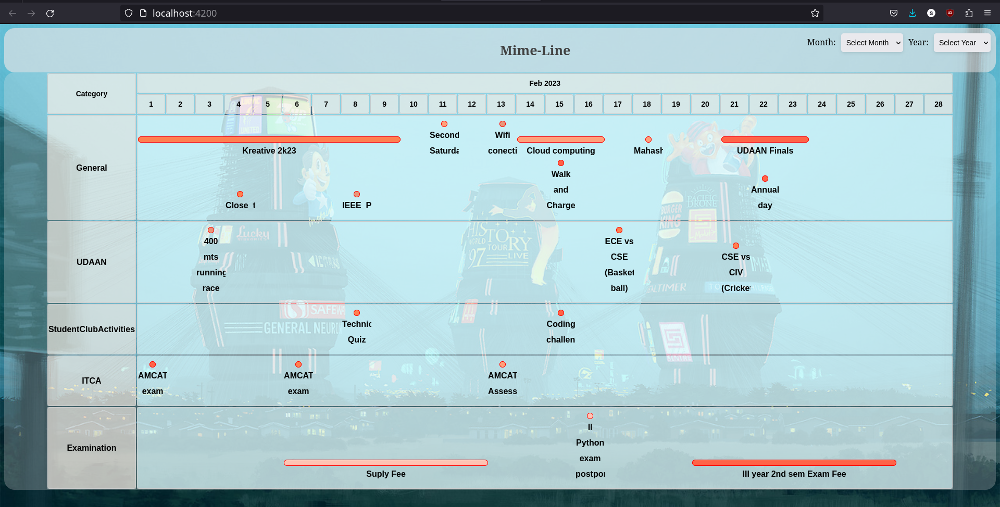

# Mime-Line

This project aims to show all the notifications and deadlines in a graphical representation.

## Requirements:
- Angular
- Node js
- npm

## How to run:
- clone this repository by 
"git clone https://github.com/Amar-and-Stuff/mime_line.git" in your terminal.
- Then cd into the repository by "cd mime-line"
- Run "ng serve --open" in terminal to run the project

### Background image credit : Simon Stålenhag's art